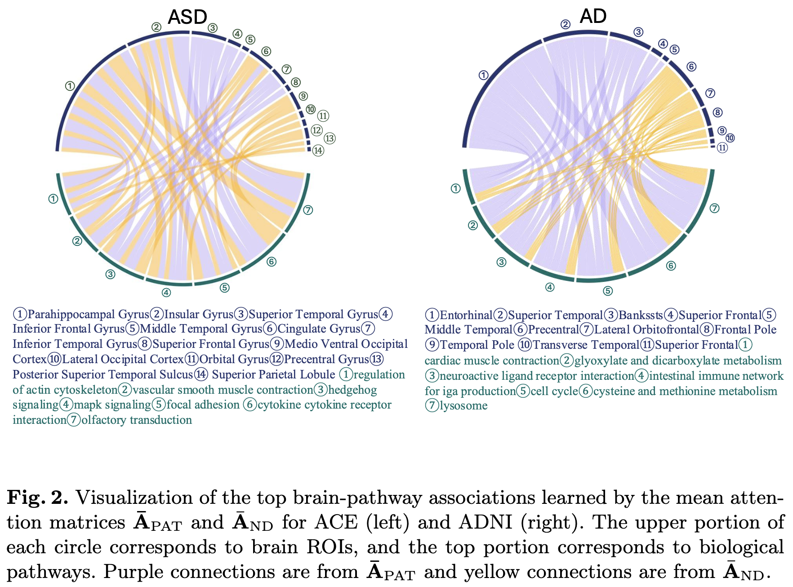
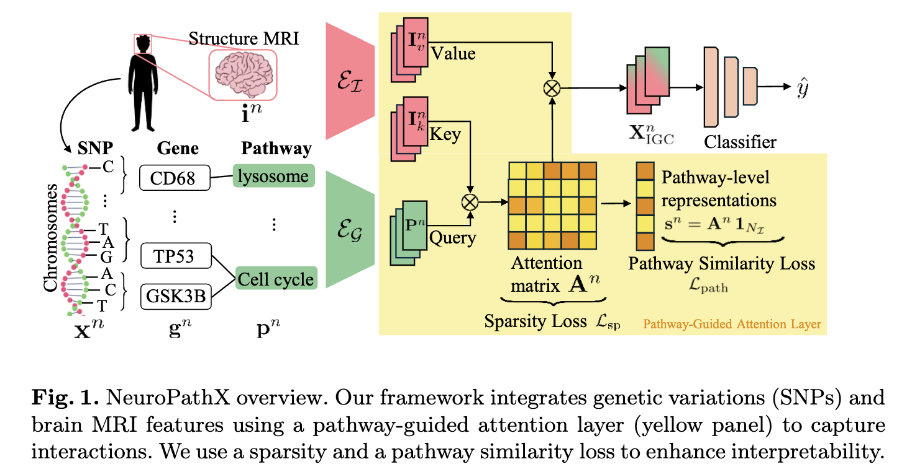
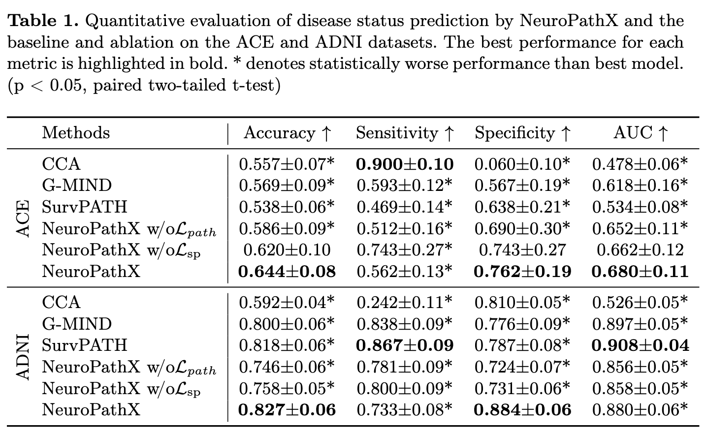

<div align="center">  

## Learning Explainable Imaging-Genetics Associations Related to a Neurological Disorder


[](https://arxiv.org/pdf/2508.18303)
</div>
Reference Implementation of paper "Learning Explainable Imaging-Genetics Associations Related to a Neurological Disorder".

### Imaging-Genetics Associations


## Overview
NeuroPathX fuses MRI-derived brain features with pathway-aggregated genetic signals via pathway-guided cross-attention. Paired sparsity and pathway-similarity losses stabilize interpretation of region–pathway interactions, enabling robust biological insight even in small-sample settings.

## Method


## Results
### Quantitative Results


## Citation
If any of the results in this paper or code are useful for your research, please cite the corresponding paper:
```
@article{wang2025learning,
  title={Learning Explainable Imaging-Genetics Associations Related to a Neurological Disorder},
  author={Wang, Jueqi and Jacokes, Zachary and Van Horn, John Darrell and Schatz, Michael C and Pelphrey, Kevin A and Venkataraman, Archana},
  journal={arXiv preprint arXiv:2508.18303},
  year={2025}
}
```